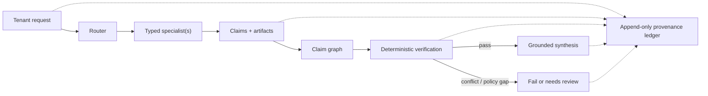

# VECL-QB

VECL-QB is a Python research prototype for provenance-first expert orchestration and bounded
continual learning. A request is routed to typed specialists; their claims become a graph;
deterministic policy verifies that graph before synthesis; and consequential transitions are
recorded in an append-only, tenant-scoped provenance chain.

The repository is intentionally honest about its boundary: the CPU orchestration, provenance,
sparse-update, local persistence, and fail-closed release-gate paths are implemented and tested.
CUDA and executable TLA+ verification are not implemented. Cloud/model evaluations are optional,
cost-bearing experiments and are never part of the default check.

## Ten-minute evaluation

Prerequisites: Python 3.10–3.12 and [uv](https://docs.astral.sh/uv/). From a fresh clone:

```bash
uv sync --frozen
uv run make check
uv run python examples/magellan_freight_qb/demo.py
```

`make check` is non-mutating: it checks formatting, Ruff, strict mypy, and the full pytest suite.
CI runs the same quality boundary on Python 3.10 and 3.12. Coverage is reported separately with
`uv run make coverage`; no arbitrary percentage is treated as proof of correctness.

The local freight demo uses deterministic toy specialists so it needs no credentials or external
services. Representative output (event UUIDs omitted):

```text
Accepted case
Verification status: PASSED
Claim graph: af5324cb0a6df73a615f4ae831f4d81e498ac439765b20cdd9bcdc755c52bdde

Bad case: rate advantage but missing temperature qualification
Auditable recommendation:
Claims conflict; synthesis requires review.
Verification status: NEEDS_REVIEW
Claim graph: 90079bcde232e0ab4011e4b39109f91da574c3b6050238b0194d33d694658dbd
```

## Core flow



The same governance shape applies to learning: a prepared learning event authorizes a bounded
number of slots; the update is checked against the CPU oracle; the token is revalidated at commit;
and the mutation is appended as a provenance event or aborted.

## Implemented today

- Rule-based and prompted routing, typed specialist requests/responses, claim graphs, conflict and
  root-support verification, grounded synthesis, and DAG specialist chains.
- Immutable event payloads with payload hashes, chain hashes, parent links, tenant checks, typed
  learning-event references, and full in-memory/SQLite chain-integrity verification.
- Deterministic sparse scoring and TopK, bounded learning tokens, commit-time authorization checks,
  selected-slot cardinality enforcement, exact slot/delta checks, and tight numeric comparison to
  an independently recomputed CPU oracle.
- Append-only quarantine, checkpoint, rollback, sleep/replay, trace, artifact, and local episodic
  storage paths.
- A release report and gate that require a hashed manifest, clean Git revision, evaluator
  identity/version, candidate binding, command/configuration, result hashes, complete gate
  categories, and non-synthetic evidence before approval. Sensitive environment values are
  redacted from recorded configuration.
- Optional real-tool adapters for Stockfish, SymPy, BLAST+, Terraform plan/validate, Yosys,
  OpenROAD, and TimesFM. Availability and external dependencies vary by specialist.

## Explicitly mocked, optional, experimental, or planned

- `examples/magellan_freight_qb` is a deterministic teaching fixture, not a freight integration.
- Model-authored routing and cloud/GPU evaluations are opt-in experiments. They require their own
  credentials, binaries/models, and review; no cloud resource is invoked by setup, tests, or demos.
- The `cuda/` and `vecl.sparse.cuda_like` paths are scaffolding that currently delegate to the CPU
  oracle. They are not an accelerator and are not independent differential evidence.
- `specs/tla/` contains non-executable design placeholders. There is no checked-in TLA+ state
  machine, TLC configuration, reproducible TLC run, or formal-verification claim.
- The checked-in Frontier/Vertex release manifests cover only part of the required evidence matrix.
  They can produce diagnostic reports but, as checked in, cannot approve a release. Demo summary
  evaluators are explicitly synthetic and can never satisfy the production gate.
- This is not a production security boundary, distributed scheduler, model-serving platform, or
  proof that specialist outputs are factually correct. SQLite and in-memory implementations are
  local prototype substrates.

## Design tradeoffs

- Provenance favors auditability over write throughput: events are copied into immutable payloads,
  hashed, tenant-validated, and chain-verified. SQLite appends serialize the chain head.
- The CPU oracle is deliberately small and authoritative. An accelerator is not trusted merely
  because it exposes the same API; it will need a genuinely independent implementation and
  differential suite.
- Release evidence records how an evaluation ran, but it is not remote attestation. Approval is
  intentionally limited to a clean checkout and a complete, content-hashed report.
- Verification is structural and policy-based. It detects unsupported/conflicting claims and
  missing roots; it does not replace domain validation performed by a specialist.
- Opt-in tool download helpers reject archive traversal and links, but they do not implement
  signed-binary attestation. Serious evaluations should supply independently pinned local
  binaries rather than treating a successful download as a trust proof.
- Historical experiment results and hashes are preserved under `docs/`, `reports/`, and data
  metadata. Large generated corpora are excluded from Git and have a deterministic regeneration
  path in [`data/README.md`](data/README.md).

## Suggested 10–20 minute review path

1. Run the commands above, then read the compact request path in
   [`vecl/qb/orchestrator.py`](vecl/qb/orchestrator.py),
   [`vecl/qb/claim_graph.py`](vecl/qb/claim_graph.py), and
   [`vecl/qb/verifier.py`](vecl/qb/verifier.py).
2. Inspect the integrity boundary in [`vecl/provenance/events.py`](vecl/provenance/events.py) and
   [`vecl/provenance/ledger.py`](vecl/provenance/ledger.py).
3. Follow one authorized mutation through [`vecl/runtime/tokens.py`](vecl/runtime/tokens.py),
   [`vecl/runtime/monitor.py`](vecl/runtime/monitor.py), and
   [`vecl/sparse/oracle.py`](vecl/sparse/oracle.py).
4. Finish at the release boundary in [`vecl/evaluation/types.py`](vecl/evaluation/types.py),
   [`vecl/evaluation/evaluators.py`](vecl/evaluation/evaluators.py), and
   [`vecl/runtime/release_gate.py`](vecl/runtime/release_gate.py).

Three adversarially useful test files:

- [`tests/provenance/test_ledger.py`](tests/provenance/test_ledger.py) — immutable payloads,
  cross-tenant/type rejection, and chain tamper detection.
- [`tests/runtime/test_monitor.py`](tests/runtime/test_monitor.py) — token, slot, oracle, and
  commit-time tamper/expiry rejection.
- [`tests/evaluation/test_release_harness.py`](tests/evaluation/test_release_harness.py) — missing,
  synthetic, incomplete, malformed, and tampered evidence fails closed.

The corresponding concise decisions are
[`ADR-002`](docs/adr/ADR-002-cpu-oracle-before-cuda.md),
[`ADR-004`](docs/adr/ADR-004-no-update-without-token.md), and
[`ADR-024`](docs/adr/ADR-024-release-evaluation-harness.md). Historical research material is
preserved in [`docs/research`](docs/research/README.md) but is not the current implementation
contract.

## Repository operations

```bash
uv run make test-core PYTHON="uv run python"
uv run make coverage
uv run vecl release evaluate CANDIDATE --manifest PATH --output release-report.json
```

The release command will return a diagnostic report even when its thresholds pass; promotion via
`vecl release approve` still rejects incomplete or ineligible evidence. See
[`CONTRIBUTING.md`](CONTRIBUTING.md) for change expectations and the [MIT license](LICENSE).
